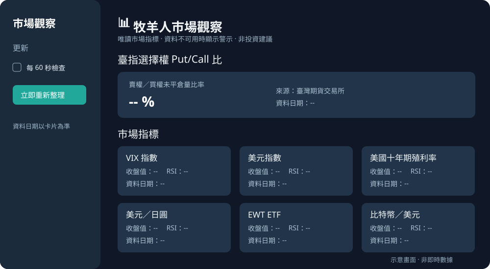

# 牧羊人市場觀察｜Risk Dashboard

用 Streamlit 把臺指選擇權 Put/Call 比、跨市場收盤值與 14 日 RSI 整理在同一個唯讀頁面。每個指標分別標示資料日期；來源失敗時會顯示「資料不可用」與原因，不把舊數值當作最新資料。



> 圖片是介面**示意**，其中的 `--` 是佔位符；請執行程式查看來源實際回傳的數據。本專案用於資料顯示與程式展示，不提供買賣建議或預測。

## 快速開始

建議使用 Python 3.10 以上。在專案資料夾執行：

```bash
python -m venv .venv
```

Windows PowerShell：

```powershell
.venv\Scripts\python -m pip install -r requirements.txt
.venv\Scripts\python -m streamlit run app.py
```

macOS / Linux：

```bash
.venv/bin/python -m pip install -r requirements.txt
.venv/bin/python -m streamlit run app.py
```

Streamlit 啟動後，在終端機顯示的本機網址開啟頁面。左側可按「立即重新整理」，也可選擇每 60 秒檢查一次；是否有新數值仍取決於各資料來源。

## 頁面與資料來源

| 區塊 | 實際欄位及來源 | 更新與限制 |
| --- | --- | --- |
| 臺指選擇權 Put/Call 比 | [臺灣期貨交易所](https://www.taifex.com.tw/cht/3/pcRatio)的「買賣權未平倉量比率%」；程式讀取期交所的下載端點 | 最多回查七個日曆日，顯示**資料日期**；沒有對應資料或回應異常會警示。不代表即時行情。 |
| VIX、美元指數、美國十年期公債殖利率指數、美元／日圓、EWT ETF、比特幣／美元 | 由第三方套件 [yfinance](https://github.com/ranaroussi/yfinance) 讀取 Yahoo Finance 的 `^VIX`、`DX-Y.NYB`、`^TNX`、`JPY=X`、`EWT`、`BTC-USD` 日線 | 每張卡片顯示最後一筆有效日線的日期及相對上一筆的變化。第三方資料可能延遲、缺漏或調整；`EWT` 是 ETF，並非臺灣加權指數。 |
| 14 日 RSI | 以上述 Yahoo Finance 收盤序列在本機計算 | 由最近 14 個漲跌變化計算；只做數值展示，沒有「安全／危險」判定。 |

臺北時間的「頁面檢查時間」只表示這次畫面更新的時間，**不是**市場數據發布時間。期交所查詢若連線失敗或欄位改變，程式不會跳過錯誤改顯示更早日期；Yahoo 單一卡片失敗也不會影響其他卡片。

## 結構與檢查

- `app.py`：介面、快取及手動／定時檢查。
- `data_sources.py`：HTTP、CSV 格式驗證、Yahoo 日線整理與 RSI 計算。
- `tests/test_data_sources.py`：以替身資料測試有效回應、缺資料與來源失敗，**不呼叫真實行情**。

執行測試：

```bash
python -m unittest discover -s tests -v
```

本專案沒有帳戶登入、下單功能，也不需要 API 金鑰。資料或第三方服務的使用須遵循各來源條款；公開展示請以各來源原站作核對。
